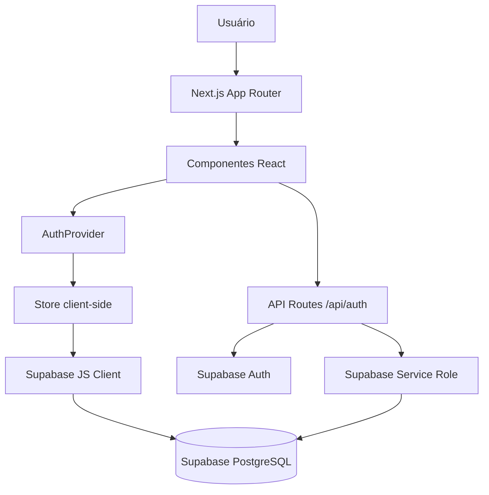
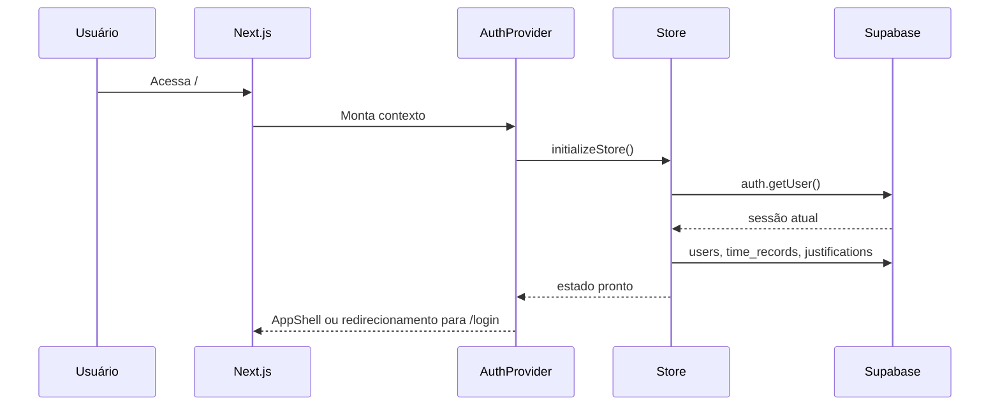

# Documentação Técnica do Projeto Meu Ponto CLT

## Sumário

- [1. Capa](#1-capa)
- [2. Apresentação](#2-apresentação)
- [3. Arquitetura Geral](#3-arquitetura-geral)
- [4. Estrutura de Pastas](#4-estrutura-de-pastas)
- [5. Tecnologias Utilizadas](#5-tecnologias-utilizadas)
- [6. Dependências](#6-dependências)
- [7. Variáveis de Ambiente](#7-variáveis-de-ambiente)
- [8. Banco de Dados](#8-banco-de-dados)
- [9. Supabase](#9-supabase)
- [10. Rotas e Páginas](#10-rotas-e-páginas)
- [11. Componentes](#11-componentes)
- [12. Hooks e Estado](#12-hooks-e-estado)
- [13. Serviços e Módulos de Domínio](#13-serviços-e-módulos-de-domínio)
- [14. APIs Internas](#14-apis-internas)
- [15. Fluxos do Sistema](#15-fluxos-do-sistema)
- [16. Regras de Negócio](#16-regras-de-negócio)
- [17. Segurança](#17-segurança)
- [18. Performance](#18-performance)
- [19. PWA](#19-pwa)
- [20. Testes](#20-testes)
- [21. Guia para Desenvolvedores](#21-guia-para-desenvolvedores)
- [22. Pontos de Atenção](#22-pontos-de-atenção)
- [23. Glossário](#23-glossário)
- [24. Conclusão](#24-conclusão)

## 1. Capa

| Campo | Informação |
|---|---|
| Nome do projeto | Meu Ponto CLT |
| Empresa | Virtus Soft |
| Versão | 0.1.0 |
| Data da documentação | 02/07/2026 |
| Tipo de sistema | Aplicação web/PWA para controle pessoal de jornada CLT |
| Tecnologias usadas | Next.js, React, JavaScript, Tailwind CSS, Supabase, PWA, XLSX, Vercel Analytics |

Esta documentação foi criada exclusivamente a partir do código-fonte presente no projeto.

## 2. Apresentação

O Meu Ponto CLT é uma aplicação para registrar, acompanhar e organizar a jornada de trabalho de um usuário. O sistema centraliza batidas de ponto, cálculo de horas trabalhadas, banco de horas, justificativas, relatórios mensais, ajustes manuais de jornada e importação/exportação de planilhas.

O produto é voltado para usuários que desejam acompanhar a própria rotina de trabalho, com dados de perfil profissional, empresa, função, avatar, jornada semanal e relógio da empresa.

Funcionalidades implementadas:

- Cadastro com confirmação por e-mail.
- Login com Supabase Auth.
- Recuperação e redefinição de senha.
- Registro de entrada, pausa, retorno e saída.
- Validação da ordem correta das batidas.
- Cálculo de jornada, horas trabalhadas e banco de horas.
- Registro de justificativas.
- Relatório mensal com gráficos e planilha editável.
- Ajuste manual de registros de ponto.
- Configuração de perfil, login, jornada e relógio da empresa.
- Importação e exportação de registros de ponto por XLSX.
- Páginas legais de privacidade, termos de uso e compliance de dados.
- PWA com manifest, service worker e tela offline.

## 3. Arquitetura Geral

O projeto usa Next.js App Router com componentes React client-side, Supabase como backend de autenticação e banco de dados, e uma store client-side em `lib/data/store.js` para centralizar sessão, perfil, pontos e justificativas.



### Camadas

| Camada | Local | Responsabilidade |
|---|---|---|
| Rotas e páginas | `app/` | Define layout, páginas públicas, página autenticada, tela offline e APIs. |
| Interface | `components/` | Telas, componentes de domínio e componentes visuais reutilizáveis. |
| Autenticação | `lib/auth/` e `components/auth/` | Contexto, guards, telas de login/cadastro e validações de credenciais. |
| Estado e persistência | `lib/data/store.js` | Store em memória, cache curto, leitura/escrita no Supabase. |
| Supabase | `lib/supabase/` | Clientes Supabase browser, auth server e service role. |
| Regras de tempo | `lib/time/time-utils.js` | Cálculos de jornada, banco de horas, datas e horários. |
| Arquivos XLSX | `lib/files/xlsx-utils.js` | Parsing de planilhas e exportação de registros. |
| PWA | `public/manifest.json`, `public/sw.js` | Instalabilidade, cache e fallback offline. |

### Fluxo Principal



## 4. Estrutura de Pastas

| Caminho | Responsabilidade |
|---|---|
| `app/` | App Router do Next.js, layout raiz, páginas, APIs e CSS global. |
| `app/api/auth/` | Endpoints server-side para cadastro, recuperação e redefinição de senha. |
| `components/app/` | Shell da aplicação, splash, status de conexão, tela offline e registro do service worker. |
| `components/auth/` | Guards e telas de autenticação. |
| `components/legal/` | Componente comum para páginas legais. |
| `components/ponto/` | Tela principal de batida de ponto. |
| `components/reports/` | Relatório mensal e planilha editável. |
| `components/settings/` | Perfil, jornada, justificativas, planilhas e avatar. |
| `components/theme/` | Provider e alternância de tema. |
| `components/ui/` | Componentes visuais reutilizáveis. |
| `lib/auth/` | Validações, contexto de auth e rate limit server-side. |
| `lib/data/` | Store client-side e constantes de domínio. |
| `lib/files/` | Conversão de planilhas XLSX. |
| `lib/legal/` | Conteúdo das páginas legais. |
| `lib/profile/` | Cálculo de idade e validação de maioridade. |
| `lib/supabase/` | Clientes Supabase. |
| `lib/time/` | Utilitários de data, hora e banco de horas. |
| `lib/utils/` | Utilitário `cn` para classes CSS. |
| `public/` | Ícones, manifest e service worker. |
| `supabase/migrations/` | Migração SQL do schema atual. |
| `tests/` | Testes unitários em Node. |
| `docs/` | Documentação técnica. |

## 5. Tecnologias Utilizadas

| Tecnologia | Finalidade | Uso no projeto |
|---|---|---|
| Next.js 16 | Framework web, App Router, build e API routes | `app/`, scripts `dev`, `build`, `start` |
| React 19 | Construção da interface | Componentes JSX |
| JavaScript/JSX | Linguagem principal | Todo o código da aplicação |
| Tailwind CSS 4 | Estilização | `app/globals.css` e classes nos componentes |
| Supabase | Auth e banco PostgreSQL | `lib/supabase`, APIs e store |
| PWA | Instalação e fallback offline | `manifest.json`, `sw.js` |
| XLSX | Importação/exportação de planilhas | `xlsx-utils.js` e `SpreadsheetSection` |
| Vercel Analytics | Analytics em produção | `app/layout.jsx` |
| Framer Motion | Animações de abas/transições | `AppShell` |
| Lucide React | Ícones | Botões, menus, cards e telas |
| Sonner | Toasts | Feedback de ações |
| next-themes | Tema claro/escuro | `ThemeProvider`, `ThemeToggle` |
| Base UI/shadcn | Primitivas e composição de UI | `components/ui/*` |

## 6. Dependências

### Dependências de Produção

| Dependência | Finalidade |
|---|---|
| `@base-ui/react` | Primitivas para dialog, select, dropdown, tabs e switch. |
| `@supabase/supabase-js` | Comunicação com Supabase Auth e PostgreSQL. |
| `@vercel/analytics` | Analytics em produção. |
| `class-variance-authority` | Variantes de componentes UI. |
| `clsx` | Classes condicionais. |
| `framer-motion` | Animações. |
| `lucide-react` | Ícones. |
| `next` | Framework da aplicação. |
| `next-themes` | Controle de tema. |
| `react` | Biblioteca de UI. |
| `react-dom` | Renderização React. |
| `shadcn` | Ecossistema/base de componentes UI. |
| `sonner` | Toasts. |
| `tailwind-merge` | Merge de classes Tailwind. |
| `tw-animate-css` | Animações CSS para Tailwind. |
| `xlsx` | Leitura e escrita de planilhas. |

### Dependências de Desenvolvimento

| Dependência | Finalidade |
|---|---|
| `@tailwindcss/postcss` | Integração Tailwind/PostCSS. |
| `postcss` | Processamento CSS. |
| `tailwindcss` | Engine CSS utilitária. |

## 7. Variáveis de Ambiente

| Variável | Obrigatória | Finalidade |
|---|---|---|
| `NEXT_PUBLIC_SUPABASE_URL` | Sim | URL pública do projeto Supabase. |
| `NEXT_PUBLIC_SUPABASE_ANON_KEY` | Sim | Chave pública anon usada no cliente e auth server. |
| `SUPABASE_SERVICE_ROLE_KEY` | Sim para APIs server-side | Chave privilegiada usada apenas no servidor. |
| `NEXT_PUBLIC_SITE_URL` | Opcional | URL pública usada nos redirects de e-mail. |

Valores reais não devem ser expostos na documentação ou versionados.

## 8. Banco de Dados

O schema está em `supabase/migrations/20260620103000_schema_atual_unico.sql`.

### Tabela `users`

Finalidade: perfil da aplicação vinculado ao usuário do Supabase Auth.

| Coluna | Tipo | Observação |
|---|---|---|
| `id` | `uuid` | Primary key, corresponde ao usuário do Auth. |
| `email` | `text` | Obrigatório e único. |
| `name` | `text` | Nome do usuário. |
| `birth_date` | `date` | Data de nascimento. |
| `company_name` | `text` | Empresa. |
| `job_title` | `text` | Função/cargo. |
| `avatar_icon` | `text` | Avatar por ícone, padrão `user`. |
| `is_active` | `boolean` | Controle de conta ativa. |
| `schedule` | `integer[]` | Jornada semanal em minutos. |
| `punch_fields` | `jsonb` | Campos de ponto habilitados por dia. |
| `clock_offset_minutes` | `integer` | Offset em minutos, entre -720 e 720. |
| `clock_offset_seconds` | `integer` | Offset em segundos, entre -43200 e 43200. |
| `created_at` | `timestamptz` | Data de criação. |

Índices/constraints:

- Primary key em `id`.
- Unique em `email`.
- Índice `idx_users_email`.
- Check de `punch_fields` como array de 7 posições.
- Checks de limite para offsets do relógio.

RLS:

- Usuário autenticado só acessa o próprio perfil.
- Atualização/deleção exigem usuário ativo.

Triggers/funções:

- `is_active_user()`.
- `protect_user_profile_fields()`.
- Trigger `protect_user_profile_fields_trigger`.
- `handle_new_auth_user()`.
- Trigger `on_auth_user_created` em `auth.users`.

### Tabela `time_records`

Finalidade: armazenar registros de ponto por usuário e data.

| Coluna | Tipo | Observação |
|---|---|---|
| `id` | `uuid` | Primary key com `gen_random_uuid()`. |
| `user_id` | `uuid` | FK para `users(id)`. |
| `date` | `date` | Data do ponto. |
| `entry_time` | `time` | Entrada. |
| `break_time` | `time` | Pausa. |
| `return_time` | `time` | Retorno. |
| `exit_time` | `time` | Saída. |
| `created_at` | `timestamptz` | Criação. |
| `updated_at` | `timestamptz` | Atualização. |

Índices/constraints:

- Unique `(user_id, date)`.
- Índices por `user_id` e `date`.
- FK com `ON DELETE CASCADE`.

RLS:

- Usuário autenticado e ativo só acessa seus próprios registros.

### Tabela `justifications`

Finalidade: registrar justificativas que influenciam ou explicam o banco de horas.

| Coluna | Tipo | Observação |
|---|---|---|
| `id` | `uuid` | Primary key com `gen_random_uuid()`. |
| `user_id` | `uuid` | FK para `users(id)`. |
| `date` | `date` | Data justificada. |
| `type` | `text` | Tipo da justificativa. |
| `reason` | `text` | Motivo opcional. |
| `start_time` | `time` | Início do abono. |
| `end_time` | `time` | Fim do abono. |
| `created_at` | `timestamptz` | Criação. |

Tipos aceitos:

- `falta`
- `justificada`
- `atestado`
- `feriado`
- `ferias`
- `folga`
- `abono`

Índices/constraints:

- Unique `(user_id, date)`.
- Índices por `user_id` e `date`.
- Check de tipos permitidos.
- Check para garantir `end_time > start_time` quando aplicável ao abono.

RLS:

- Usuário autenticado e ativo só acessa suas próprias justificativas.

## 9. Supabase

O Supabase é usado para autenticação e banco de dados.

| Módulo | Arquivo | Uso |
|---|---|---|
| Cliente browser | `lib/supabase/supabase.js` | Operações client-side com anon key. |
| Cliente server auth | `lib/supabase/supabase-auth-server.js` | Cadastro e recuperação sem persistência de sessão. |
| Cliente service role | `lib/supabase/supabase-service-role.js` | Operações privilegiadas em APIs server-side. |

Fluxos com Supabase:

- `signInWithPassword` para login.
- `signUp` para cadastro.
- `exchangeCodeForSession` para confirmação de e-mail e recuperação.
- `resetPasswordForEmail` para envio de e-mail de redefinição.
- `auth.admin.updateUserById` para troca de senha após validação do token.
- CRUD em `users`, `time_records` e `justifications`.

## 10. Rotas e Páginas

| URL | Finalidade | Componentes principais | Autenticação |
|---|---|---|---|
| `/` | Aplicação principal autenticada | `AuthProvider`, `AuthenticatedAppRoute`, `AppShell` | Requer sessão |
| `/login` | Login e solicitação de reset | `AuthLoginRoute`, `LoginScreen` | Pública para visitantes |
| `/cadastro` | Cadastro | `AuthRegisterRoute`, `RegisterScreen` | Pública para visitantes |
| `/confirmar-email` | Confirmação de e-mail | `EmailConfirmationScreen` | Link Supabase |
| `/redefinir-senha` | Redefinição de senha | `PasswordResetScreen` | Sessão temporária |
| `/offline` | Fallback offline | `OfflineScreen` | Pública |
| `/privacidade` | Política de privacidade | `LegalPage` | Pública |
| `/termos-de-uso` | Termos de uso | `LegalPage` | Pública |
| `/compliance-de-dados` | Compliance de dados | `LegalPage` | Pública |
| `not-found` | Página 404 | `RouteBlockScreen` | Pública |

## 11. Componentes

### Aplicação

| Componente | Responsabilidade |
|---|---|
| `AppShell` | Header, menu do usuário, navegação inferior e abas Ponto/Relatório/Ajustes. |
| `ConnectionStatus` | Monitora conexão e exibe toasts de online/offline/falhas de rede. |
| `OfflineScreen` | Tela de falha de conexão. |
| `RouteBlockScreen` | Tela para rota inexistente ou restrita. |
| `ServiceWorkerRegister` | Registra service worker em produção. |
| `SplashScreen` e `OpeningSplash` | Splash de carregamento. |

### Autenticação

| Componente | Responsabilidade |
|---|---|
| `AuthProvider` | Inicializa store, observa eventos de auth e expõe ações de autenticação. |
| `AuthenticatedAppRoute` | Protege a rota principal. |
| `AuthLoginRoute` | Impede usuário logado de ver login. |
| `AuthRegisterRoute` | Impede usuário logado de ver cadastro. |
| `LoginScreen` | Login e solicitação de recuperação de senha. |
| `RegisterScreen` | Cadastro em etapas. |
| `EmailConfirmationScreen` | Processa confirmação de e-mail. |
| `PasswordResetScreen` | Processa redefinição de senha. |
| `PasswordField` | Campo de senha com alternância de visibilidade. |

### Domínio

| Componente | Responsabilidade |
|---|---|
| `PunchView` | Registro diário de ponto e resumo mensal. |
| `ReportView` | Relatório mensal, gráfico e planilha editável. |
| `SettingsView` | Perfil, justificativas e planilhas. |
| `AvatarPicker` | Seleção de avatar por ícone. |
| `UserAvatar` | Renderização do avatar selecionado. |
| `LegalPage` | Estrutura comum para páginas legais. |
| `ThemeProvider` | Provider de tema. |
| `ThemeToggle` | Botão de alternância de tema. |

### UI Reutilizável

Componentes em `components/ui/`:

- `Button`
- `Badge`
- `Card`
- `Dialog`
- `AlertDialog`
- `DropdownMenu`
- `Input`
- `Label`
- `Select`
- `Sonner/Toaster`
- `Switch`
- `Tabs`

## 12. Hooks e Estado

| Hook/Fonte | Arquivo | Uso |
|---|---|---|
| `useAuth` | `lib/auth/auth-context.jsx` | Acessa usuário, estado de carregamento e ações de auth. |
| `useStoreData` | `lib/auth/auth-context.jsx` | Lê dados da store com `useSyncExternalStore`. |
| `useTheme` | `components/theme/theme-toggle.jsx` | Lê/altera tema. |
| `useRouter` | Componentes de rota | Redirecionamentos. |
| `useSearchParams` | Confirmação/redefinição | Leitura de `code` e `email` da URL. |

Estado central:

- `state.user`
- `state.users`
- `state.records`
- `state.justifications`
- `state.ready`

O cache de dados em `store.js` usa TTL de 30 segundos para reduzir leituras duplicadas após eventos de autenticação.

## 13. Serviços e Módulos de Domínio

| Arquivo | Responsabilidade |
|---|---|
| `lib/data/store.js` | Store, autenticação client-side, CRUD Supabase, cache e importação. |
| `lib/data/types.js` | Constantes de justificativas, jornada e campos de ponto. |
| `lib/time/time-utils.js` | Datas, horários, cálculo trabalhado e banco de horas. |
| `lib/files/xlsx-utils.js` | Conversão de linhas XLSX para registros e registros para exportação. |
| `lib/auth/security-utils.js` | Validação de e-mail e senha. |
| `lib/auth/auth-utils.js` | Validação server-side de cadastro e mapeamento de perfil. |
| `lib/auth/server-rate-limit.js` | Rate limit em memória para APIs de auth. |
| `lib/profile/profile-utils.js` | Cálculo de idade e validação de maioridade. |
| `lib/legal/legal-content.js` | Conteúdo textual das páginas legais. |
| `lib/utils/utils.js` | Função `cn` para classes CSS. |

## 14. APIs Internas

### `POST /api/auth/register`

Cria cadastro via Supabase Auth e grava o perfil em `users`.

Validações:

- Nome obrigatório.
- Data de nascimento obrigatória.
- Empresa obrigatória.
- Função obrigatória.
- E-mail válido.
- Senha forte.
- Rate limit de 3 tentativas por 30 minutos.

Resposta de sucesso:

```json
{ "ok": true, "email": "usuario@dominio.com" }
```

### `POST /api/auth/forgot-password`

Solicita e-mail de redefinição de senha.

Validações:

- E-mail válido.
- Rate limit de 3 tentativas por 20 minutos.

Resposta de sucesso:

```json
{ "ok": true }
```

### `POST /api/auth/reset-password`

Atualiza a senha usando token Bearer da sessão temporária de recuperação.

Validações:

- Senha forte.
- Header `Authorization: Bearer <token>`.
- Token válido no Supabase.

Resposta de sucesso:

```json
{ "ok": true }
```

## 15. Fluxos do Sistema

### Cadastro

```text
/cadastro
↓
RegisterScreen valida dados e senha
↓
store.register()
↓
POST /api/auth/register
↓
Supabase signUp
↓
Criação/atualização do perfil em users
↓
E-mail de confirmação
↓
/confirmar-email
↓
/login
```

### Login

```text
/login
↓
LoginScreen
↓
store.login()
↓
Supabase signInWithPassword
↓
refreshStore()
↓
Carrega users, time_records e justifications
↓
/
```

### Batida de Ponto

```text
PunchView
↓
Valida data atual, duplicidade, configuração e ordem
↓
store.punch(userId, field)
↓
upsert em time_records
↓
refreshStore(force)
↓
Atualização de UI, saldo e gráfico
```

### Relatório e Ajuste

```text
ReportView
↓
Seleciona mês/ano
↓
Calcula métricas com bankMetrics
↓
Usuário abre linha da planilha
↓
Validação cronológica dos horários
↓
store.adjustRecord()
↓
upsert/delete em time_records
```

### Justificativas

```text
SettingsView > Justificar
↓
Seleciona tipo e data
↓
Valida abono ou período de férias
↓
store.saveJustification()
↓
upsert em justifications
↓
Relatórios recalculam banco
```

### Importação XLSX

```text
SettingsView > Planilha
↓
Usuário seleciona arquivo
↓
Import dinâmico de xlsx
↓
rowsToRecords()
↓
Confirma importação
↓
store.importRecords()
↓
upsert em time_records por lote
```

## 16. Regras de Negócio

### Jornada

- Jornada padrão: domingo 0h, segunda a sexta 8h, sábado 4h.
- A jornada é armazenada em minutos por dia da semana.
- Dias com jornada 0 são tratados como folga.
- O usuário pode configurar a jornada de cada dia entre 0 e 24 horas.

### Batidas

- Campos possíveis: entrada, pausa, retorno e saída.
- A ordem natural é: entrada → pausa → retorno → saída.
- Após entrada, o usuário pode pausar ou sair se ambos os campos estiverem configurados.
- Retorno só é permitido após pausa.
- Saída encerra o dia.
- Só é possível bater ponto no dia atual.
- Datas anteriores são corrigidas pelo relatório.

### Banco de Horas

- Dia fechado exige entrada e saída.
- Dia aberto não entra no banco definitivo.
- Horas trabalhadas = saída - entrada - intervalo entre pausa e retorno.
- Banco = horas trabalhadas - jornada esperada ajustada.
- O cálculo em andamento congela durante pausa aberta.

### Justificativas

| Tipo | Regra |
|---|---|
| `falta` | Entra no banco como saldo negativo quando há jornada esperada. |
| `justificada` | Não entra no banco. |
| `atestado` | Não entra no banco. |
| `feriado` | Não entra no banco. |
| `ferias` | Não entra no banco e pode ser registrada em período. |
| `folga` | Não entra no banco. |
| `abono` | Reduz a jornada cobrada pelo intervalo informado. |

### Cadastro e Perfil

- Cadastro exige nome, data de nascimento, empresa e função.
- Usuário precisa ter 18 anos ou mais.
- Senha forte exige 8 caracteres ou mais, letra minúscula, letra maiúscula, número e símbolo.
- E-mail é normalizado para minúsculas.
- Avatar é escolhido entre ícones internos.

### Planilhas

- Importação aceita `.xlsx` e `.xls`.
- Colunas usadas: Data, Entrada, Pausa, Retorno e Saída.
- Todas as abas do arquivo são lidas.
- Linhas vazias ou de totalização são ignoradas.
- Dias repetidos são consolidados por data antes do upsert.
- Exportação gera planilha com registros carregados do usuário atual.

## 17. Segurança

| Recurso | Implementação |
|---|---|
| Auth | Supabase Auth com e-mail/senha. |
| Confirmação | Link de confirmação processado por `exchangeCodeForSession`. |
| Recuperação | Link de reset com sessão temporária. |
| RLS | Habilitada em `users`, `time_records` e `justifications`. |
| Service Role | Restrita a módulos server-only e API routes. |
| Rate limit | Em memória para cadastro e recuperação. |
| Validação de senha | Compartilhada entre cliente e servidor. |
| Validação de e-mail | Normalização e regex básica. |
| Usuário inativo | Bloqueado por RLS e pela store após login. |
| Dados sensíveis | Variáveis reais não devem ser expostas. |

Limites locais de tela:

- Login: até 5 tentativas.
- Solicitação de reset na tela de login: até 3 tentativas.
- Confirmação de e-mail: até 3 reprocessamentos por código no `sessionStorage`.
- Redefinição de senha: página expira após 10 minutos e limita tentativas.

## 18. Performance

| Técnica | Local | Finalidade |
|---|---|---|
| Cache de 30 segundos | `store.js` | Evitar recarregamentos duplicados. |
| Paginação de selects | `selectAll()` | Buscar todas as páginas do Supabase. |
| Upsert em lotes | `importRecords()` | Importar planilhas sem payload excessivo. |
| Import dinâmico de `xlsx` | `SpreadsheetSection` | Reduzir bundle inicial. |
| `useMemo` | `PunchView`, `ReportView` | Evitar recálculo de métricas e gráficos. |
| Service worker | `public/sw.js` | Cache de assets e fallback de navegação. |
| `next/font` | `app/layout.jsx` | Otimização da fonte Manrope. |

## 19. PWA

### Manifest

Arquivo: `public/manifest.json`.

Configura:

- Nome: Meu Ponto CLT.
- Nome curto: Meu Ponto.
- `start_url`: `/`.
- `display`: `standalone`.
- Orientação: `portrait`.
- Ícones SVG.
- Cores de tema e fundo.

### Service Worker

Arquivo: `public/sw.js`.

Comportamento:

- Cache `meu-ponto-clt-v2`.
- Pré-cache de `/`, `/offline`, manifest e ícones.
- Remove caches antigos no activate.
- Navegação usa network-first com fallback para cache, `/offline` ou `/`.
- Assets estáticos usam cache-first.
- Só processa requisições GET da própria origem.

Registro:

- `ServiceWorkerRegister` registra `/sw.js` apenas em produção.

## 20. Testes

Arquivo: `tests/run-tests.js`.

Os testes atuais cobrem:

- Conversão de horários para minutos.
- Formatação de minutos em `H:MM`.
- Cálculo de horas trabalhadas com pausa.
- Dia aberto sem banco definitivo.
- Tempo trabalhado em andamento.
- Cálculo de abono.
- Jornada esperada por dia da semana.
- Banco positivo, negativo e aberto.
- Justificativas que saem do banco.
- Abono reduzindo jornada esperada.
- Normalização e validação de e-mail.
- Critérios de senha forte.

Comandos:

```bash
npm test
npm run ci
```

## 21. Guia para Desenvolvedores

### Instalar

```bash
npm install
```

### Configurar ambiente

Criar `.env` com:

```env
NEXT_PUBLIC_SUPABASE_URL=
NEXT_PUBLIC_SUPABASE_ANON_KEY=
SUPABASE_SERVICE_ROLE_KEY=
NEXT_PUBLIC_SITE_URL=
```

### Executar em desenvolvimento

```bash
npm run dev
```

### Rodar testes

```bash
npm test
```

### Gerar build

```bash
npm run build
```

### Executar produção local

```bash
npm start
```

### Aplicar banco

Usar a migração:

```text
supabase/migrations/20260620103000_schema_atual_unico.sql
```

### Criar nova página

1. Criar rota em `app/nome-da-rota/page.jsx`.
2. Definir `metadata` se necessário.
3. Reutilizar componentes de `components/ui`.
4. Para área autenticada, seguir o padrão de `AuthProvider` e guards existentes.

### Criar novo componente

1. Colocar no domínio correto dentro de `components/`.
2. Reutilizar `Button`, `Card`, `Dialog`, `Input`, `Label` e demais componentes UI.
3. Usar `cn` para classes condicionais.
4. Manter regras compartilhadas em `lib/`.

### Adicionar regra de cálculo

1. Implementar função pura em `lib/time` ou módulo de domínio apropriado.
2. Reutilizar a função nos componentes.
3. Adicionar teste em `tests/run-tests.js`.

### Usar Supabase

- No cliente, usar `supabase` de `lib/supabase/supabase.js`.
- Em APIs server-side privilegiadas, usar `getSupabaseServiceRole`.
- Não importar service role em componentes client.
- Respeitar as policies de RLS e filtrar dados pelo usuário autenticado.

## 22. Pontos de Atenção

| Ponto | Observação |
|---|---|
| Rate limit em memória | Reduz abuso imediato, mas não é global em ambientes serverless. |
| `.env` | Chaves sensíveis não devem ser versionadas. |
| Offline | A PWA possui fallback offline, mas operações de dados exigem rede. |
| Testes | Cobrem funções puras, mas não cobrem UI, API routes ou integração Supabase. |
| Tipagem | Projeto usa JavaScript, sem TypeScript. |
| Realtime | Não há uso de Supabase Realtime no código atual. |
| Storage | Não há upload ou uso de Supabase Storage. |

## 23. Glossário

| Termo | Definição |
|---|---|
| Batida | Registro de horário de entrada, pausa, retorno ou saída. |
| Jornada | Carga esperada de trabalho para um dia. |
| Banco de horas | Diferença entre tempo trabalhado e jornada esperada. |
| Justificativa | Registro que explica ou altera o tratamento de um dia no banco. |
| Abono | Intervalo que reduz a jornada cobrada. |
| RLS | Row Level Security do PostgreSQL/Supabase. |
| Service Role | Chave Supabase privilegiada usada apenas no servidor. |
| Store | Estado client-side centralizado em `lib/data/store.js`. |
| Upsert | Operação que insere ou atualiza conforme conflito. |
| PWA | Aplicação web instalável com recursos offline. |

## 24. Conclusão

O Meu Ponto CLT é uma aplicação Next.js com Supabase voltada ao controle individual de jornada. Sua arquitetura concentra a experiência no cliente React, mantém a persistência no Supabase e centraliza regras de ponto e banco de horas em módulos reutilizáveis.

Os principais blocos do sistema são autenticação, registro de ponto, relatório mensal, justificativas, ajustes de perfil/jornada, importação/exportação XLSX e PWA. A documentação acima cobre somente funcionalidades, tecnologias, rotas e módulos encontrados no projeto.
